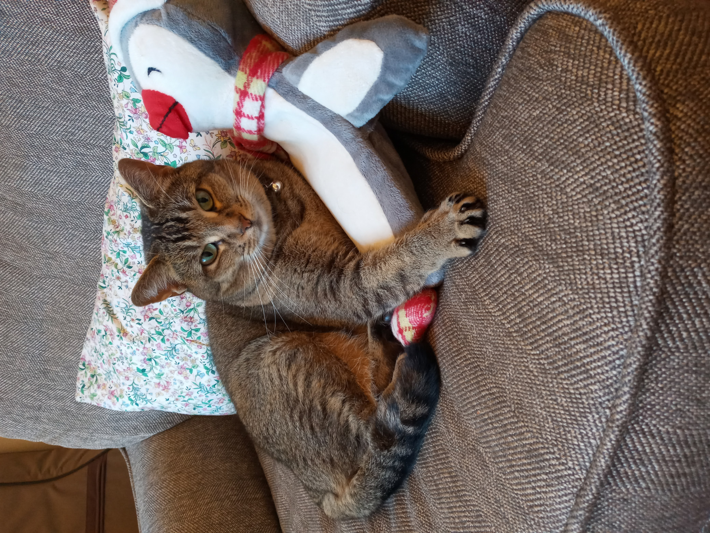
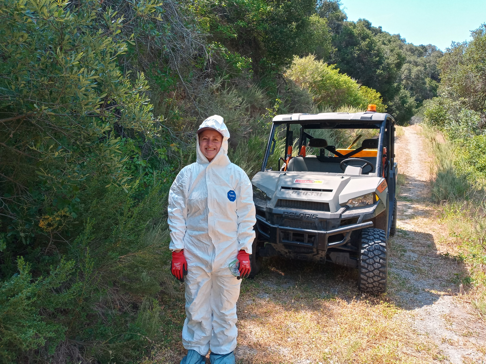

```{r setup, include=FALSE}
knitr::opts_chunk$set(echo = TRUE, message = FALSE, warning = FALSE, error = FALSE)
```

# Attach packages 

```{r}
library(tidyverse)
library(here)
library(gganimate)
library(gifski)
library(palmerpenguins)

```

# This is Rmarkdown 

Rmarkdown is super fun. Rmarkdown lets you make professional looking documents right in R! 

You can do many things with Rmarkdown including: 

## Changing the size of headings with the pound sign # 

# Large text 
## Semi large text
### Very smaller text 
#### V. little

## Text effects 

*bold text* 

**italicized text** 

***bold and italicized*** 


## Bulleted lists: 

- Fun times
- SIMS!
- Data science 

## Numbered lists: 

1. Numbers! 
2. Woooo
3. Listing


## Superscripts/Subscripts: 

superscript^UP^ or subscripts ~DOWN~

## Add hyperlink: https://www.ucsb.edu/

## Or add linked text: [UCSB](https://www.ucsb.edu/)

## Add a picture: 

Here's a picture of my cat, Luna! 

{width=500px}

Here's a super nerdy picture of me at my field site, the Jack and Laura Dangermond Preserve! 
I'm trying to avoid poison oak by wearing a tyvek suit (unfortunately I still got poison oak). 




## We can also make graphs! 

```{r}
library(tidyverse)
library(gganimate)
library(palmerpenguins)
```

A basic scatter plot! 

```{r}

view(penguins)

# A basic scatterplot with color depending on Species
ggplot(penguins, aes(x=flipper_length_mm, y=body_mass_g, color=species)) + 
    geom_point(size=6) +
    theme_bw()
```


An animated graph! Whoa!! 

```{r}
# Make 2 basic states and concatenate them:
a <- data.frame(group=c("A","B","C"), values=c(3,2,4), frame=rep('a',3))
b <- data.frame(group=c("A","B","C"), values=c(5,3,7), frame=rep('b',3))
data <- rbind(a,b)  

 
# Make a ggplot, but add frame=year: one image per year
ggplot(data, aes(x=group, y=values, fill=group)) + 
  geom_bar(stat='identity') +
  theme_bw() +
  # gganimate specific bits:
  transition_states(
    frame,
    transition_length = 2,
    state_length = 1
  ) +
  ease_aes('sine-in-out')

# Save as gif:
anim_save("288-animated-barplot-transition.gif")
```

